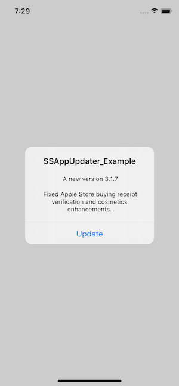
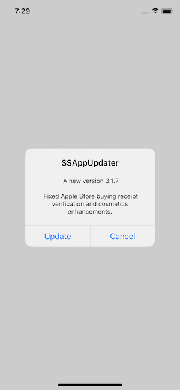
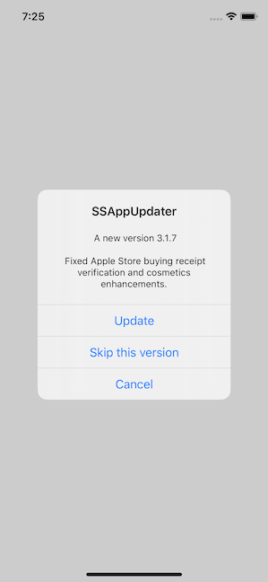
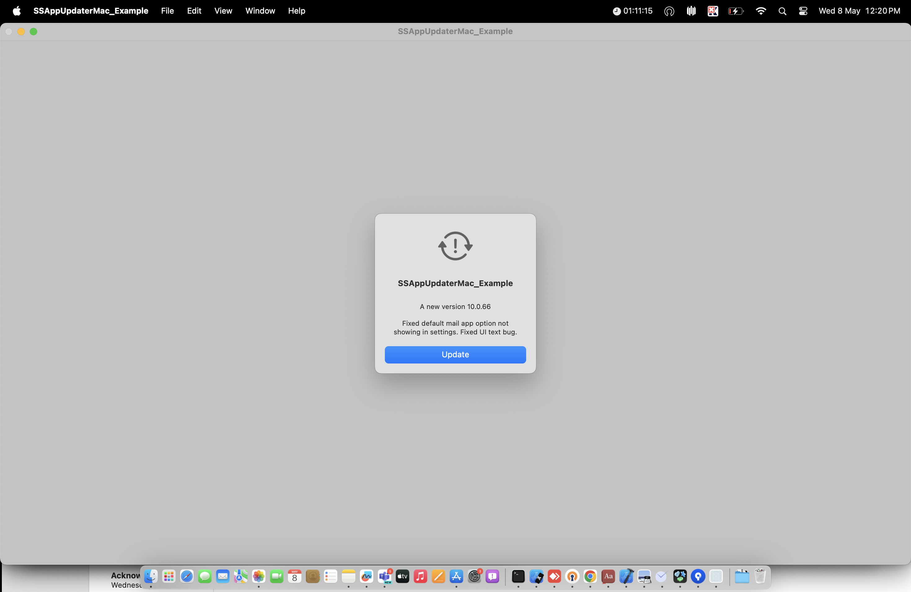
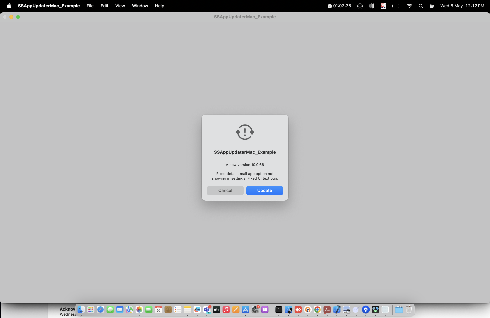
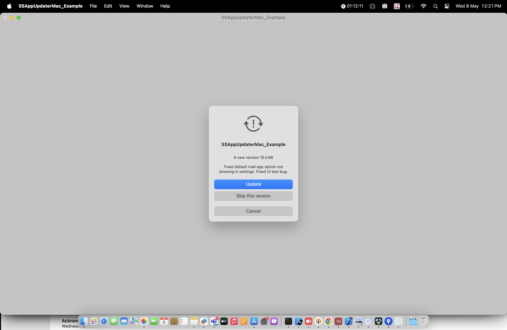
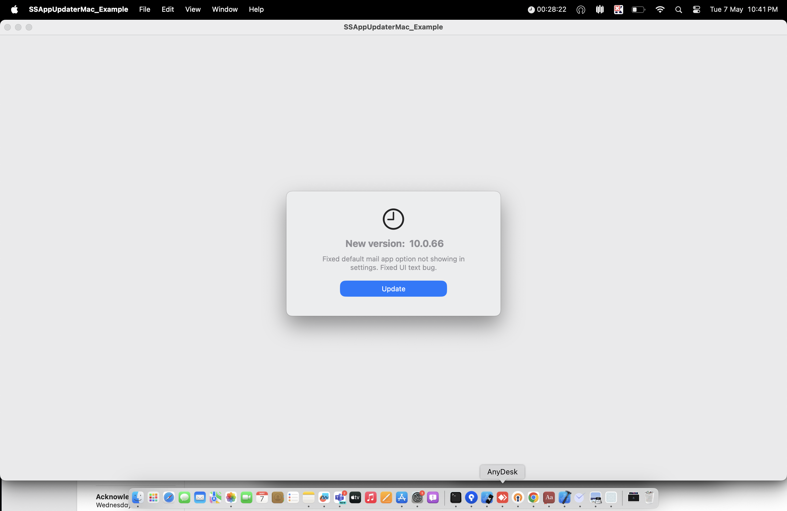

[![Swift Version][swift-image]][swift-url]
[![License][license-image]][license-url]
[![Carthage Compatible][carthage-image]][carthage-url]
[![SwiftPM Compatible][spm-image]][spm-url]
[![Platform][platform-image]][platform-url]
[![PRs Welcome][PR-image]][PR-url]

# SSAppUpdater

SSAppUpdater is an open-source framework designed to streamline the process of comparing the current version of an app with the version available in the app store for iOS and macOS. It provides key details such as the app's URL, the new version number, and release notes. With this information, you can notify users about the availability of the latest version and redirect them to update the app. 

### Table of contents
1. [Requirements](#requirements)
2. [Key Features](#key-features)
3. [Installation](#installation)
4. [Detailed Overview of the Features](#detailed-Overview-of-the-Features)

### Requirements
  - iOS 13.0+
  - macOS 11.0+
  - Xcode 9+
  - A server to host the latest build for the **manual macOS updater**

### Key Features:
1. [**Automatic Version Comparison through AppStore:**](#automatic-version-comparison-through-appStore): SSAppUpdater automatically compares the app’s current version with the latest version available in the App Store, ensuring users are always informed when updates are available.

    ##### iOS
    | Force Update | Optional Update | Skip Version |
    | :--: | :-----: | :--: |
    |  |  |  |
        
    #### macOS
    | Force update | Optional update |
    | :--: | :---: |
    |  |  |

    | Skip version | Update with custom alert |
    | :--: | :---: |
    |  |  |

2. **Manual macOS updater through server**: SSAppUpdater allows for manual version comparison on macOS by checking the current app version against the latest release available on a custom server, offering flexibility for apps not distributed through the App Store.
3. **Customizable Update Alerts**: The framework offers flexible options to present update alerts to users, enabling developers to control when and how they notify users about new updates using customised UI.

### Installation
#### 1. CocoaPods
 
- You can add SSAppUpdater to your Podfile to install it with CocoaPods. Add the following line to your Podfile within the target block where you want to use SSAppUpdater:
      
       pod 'SSAppUpdater'

- To use SSAppUpdater in your project, simply import it where needed by adding the following line to your Swift files:
       ```import SSAppUpdater```


#### 2. Manually
-   To manually add SSAppUpdater to your project, follow these steps:
    - Obtain the SSAppUpdater source code from the relevant repository or website.
    Extract and Add to Your Project
    - Drag and drop the SSAppUpdater folder into your Xcode project’s file navigator. Make sure to select "Copy items if needed" to include the files in your project directory.

-   You’re now ready to move forward.

#### 3. Swift Package Manager
-   If you’re using Xcode 11 or later, you can install SSAppUpdater by following these steps:

    1. Add via Project Settings:
        - Open your project in Xcode.
        - Navigate to your project settings.
        - Select the Swift Packages tab.
        - Click the + button to add a new package.
        - Enter the GitHub repository URL for SSAppUpdater and follow the prompts to complete the installation.
    
    2. Add via Menu Option:
        - Open Xcode and go to File in the menu bar.
        - Select Swift Packages, then choose Add Package Dependency....
        - Enter the GitHub repository URL for SSAppUpdater and follow the instructions to add it to your project.
        - This will integrate SSAppUpdater into your project, allowing you to start using it immediately.

    ```swift
    dependencies: [
        .package(url: "https://github.com/SimformSolutionsPvtLtd/SSAppUpdater.git", from: "1.1.0")
    ]
    ```

#### 4. Carthage
-   [Carthage](https://github.com/Carthage/Carthage) is a decentralized dependency manager that builds your dependencies and provides you with binary frameworks. To install Carthage, you can use Homebrew with the following command:

    ```bash
    $ brew update
    $ brew install carthage
    ```
-   To integrate SSAppUpdater into your Xcode project using Carthage, add the following line to your Cartfile:

    ```ogdl
        github ""SimformSolutionsPvtLtd/SSAppUpdater""
    ```
-   Run `carthage` to build and drag the `SSAppUpdater`(Sources/SSAppUpdater) into your Xcode project.

### Detailed Overview of the Features
#### 1. Automatic Version Comparison through AppStore:
- SSAppUpdater automatically checks the currently installed version of your iOS or macOS app against the latest version available on the App Store. When an update is available, it displays the new version number, App Store URL, App ID, and release notes, giving users the option to update. If the default alert is used and an internet connection is lost after receiving the update notification, SSAppUpdater will prevent redirection to the App Store and show an alert regarding the connection issue.

- It utilises the **iTunes Search API** to fetch detailed information, which is then used to display an update alert to the user.

- It allows you to display a default NSAlert on macOS or UIAlert on iOS. 
- To use the default alert, call `SSAppUpdater.shared.performCheck` with the following parameters:
    - `isForceUpdate` - Boolean value checks that the user wants to force update or not.
    - `updateAlertFrequency` - The user can choose alert display time. default value will be `.always`. Alternative values of this property are `daily`,`weekly` and `monthly`.
    - `skipVersionAllow` - This feature lets users activate the "skipVersion" functionality.
    - `redirectToMacAppStore` - This setting is specifically for macOS users. It gives them the choice to either be directed to the App Store app or stay within the current application to access the App Store.
    - `completion` - This will provide you with version information in the completion block.
            
    Usage:
               
    ```swift
        SSAppUpdater.shared.performCheck() { (versionInfo) in
            // Version Info have all the app update related information
            // Display AppUpdate UI based on versionInfo.isAppUpdateAvailable flag
        }
    ```
#### 2. Manual macOS updater through server:
- The **prerequisite** for using this feature is having a **server** to upload the latest build.
- This feature is available only for **macOS applications** that are not distributed through the App Store but still need to keep users' systems up to date.
- It also involves replacing the current build with a new one. When the user presses 'Update' in the default alert, the application will automatically quit, remove the old version, and install the latest build.

- **Upload build Guidelines:**
    - Install the pods of SSAppUpdater.
    - The BuildRelease.sh script will be found in the Pods/SSAppUpdater/Sources/AppDeployment directory.
    - Configuring Build Scripts (One-Time Setup)
        - Open Xcode and go to Edit Scheme.
        - Select Archive from the left sidebar.
        - In the Post-actions tab, click the + icon and choose New Run Script Phase.
        - In the newly added run script phase, enter the following script:
            ``` "${PODS_ROOT}/SSAppUpdater/Sources/AppDeployment/BuildRelease.sh" ```
    - For a new release, update the **version_info.txt** file located at `Pods/SSAppUpdater/Sources/AppDeployment` with the latest build details, including release notes and server base URL. The file structure is pre-defined; simply modify it to reflect the new build. (The `Server URL` must specify the path to the directory where you want to store the files, without including the filename)
    - After updating the version_info.txt file, follow these steps to create an archive:
        - Go to **Product > Archive** in Xcode to initiate the archiving process.
        - Once the archive is created, a post-archive script will execute. This script will:
            - Display an initial alert, informing you to wait while it processes.
            - Generate the necessary files for server upload, including **version.xml and yourAppName.zip**.
        - After the script completes its tasks, a completion alert will appear. Clicking "OK" will redirect you to the directory containing version.xml and yourAppName.zip. If you're not automatically redirected, you can locate these files in the directory: Pods/SSAppUpdater/Sources/AppDeployment/AutoGeneratedContent/ExportedArchiveContent.
        - Before uploading version.xml, ensure that the <latestBuildURL> field contains the correct server URL.
        - You can then upload these files to the server. Ensure that both files are publicly accessible.
                
- **Usage Guidelines:**
    - Use `SSAppUpdater.shared.performManualMacAppVersionCheck` to check for the latest update from the server. This function accepts the following parameters:
        - `url` - Provide the correct URL for the **version.xml** file, wherever it is hosted.
        - `isForceUpdate` - Boolean value checks that the user wants to force update or not.
        - `completion` -  This will provide you with version information in the completion block.
    - The function will compare your current build version with the latest version available on the server.
    - If a newer version is found, an alert will be displayed.
    - Clicking "Update" will:
        - Download the new build to a specified location.
        - Replace the old build with the new one.
    
    Usage:            
    ```swift
        SSAppUpdater.shared.performManualMacAppVersionCheck(url: "https://yourawsbucketname/Release/version.xml"
        ) { versionInfo in
            print(versionInfo)
        }
    ```  
    **Note:** Enter your preferred server URL into the function parameter, whether it is hosted on AWS, Azure, or any other platform.
        
    
#### 3. Customisable Update Alerts:
- A custom alert will be displayed where `SSAppUpdater.shared.performCheckAndDisplayCustomAlert` returns version information, allowing you to populate the alert with the retrieved details.
- To use the custom alert, call `SSAppUpdater.shared.performCheckAndDisplayCustomAlert` with the following parameter:
    - `completion` - This will provide you with version information in the completion block.
            
    Usage:            
    ```swift
        SSAppUpdater.shared.performCheckAndDisplayCustomAlert { (versionInfo) in
            // Version Info have all the app update related information
        }
    ```


# Inspired 
-  SSAppUpdater inspired from [Siren](https://github.com/ArtSabintsev/Siren)


[swift-image]:https://img.shields.io/badge/swift-5.0-orange.svg
[swift-url]: https://swift.org/
[carthage-image]:https://img.shields.io/badge/Carthage-compatible-4BC51D.svg?style=flat
[carthage-url]: https://github.com/Carthage/Carthage
[spm-image]:https://img.shields.io/badge/SwiftPM-compatible-brightgreen.svg
[spm-url]: https://swift.org/package-manager
[license-image]: https://img.shields.io/badge/License-MIT-blue.svg
[license-url]: LICENSE
[travis-image]: https://img.shields.io/travis/dbader/node-datadog-metrics/master.svg?style=flat-square
[travis-url]: https://travis-ci.org/dbader/node-datadog-metrics
[codebeat-image]: https://codebeat.co/assets/svg/badges/C-ffb83f-7198e9a1b7ad7f73977b0c9a5c7c3fffbfa25f262510e5681fd8f5a3188216b0.svg
[codebeat-url]: https://codebeat.co/projects/github-com-vsouza-awesomeios-com
[platform-image]:https://img.shields.io/cocoapods/p/LFAlertController.svg?style=flat
[platform-url]:http://cocoapods.org/pods/LFAlertController
[cocoa-image]:https://img.shields.io/cocoapods/v/EZSwiftExtensions.svg
[cocoa-url]:https://img.shields.io/cocoapods/v/LFAlertController.svg
[PR-image]:https://img.shields.io/badge/PRs-welcome-brightgreen.svg?style=flat-square
[PR-url]:http://makeapullrequest.com


## Check out our other Libraries

<h3><a href="https://github.com/SimformSolutionsPvtLtd/Awesome-Mobile-Libraries"><u>🗂 Simform Solutions Libraries→</u></a></h3>
